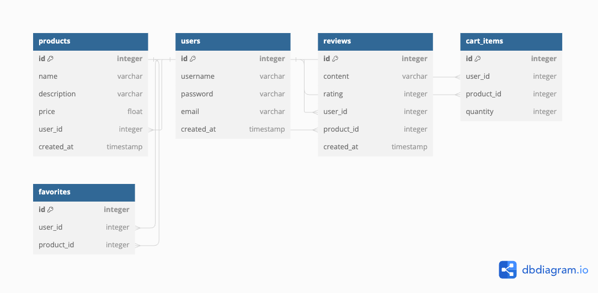
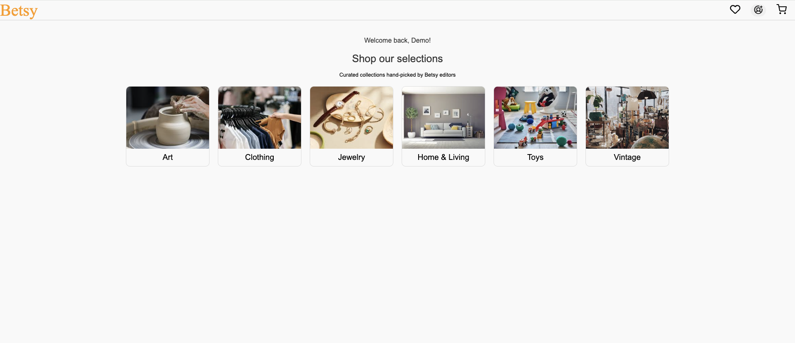

# Betsy

Checkout a live version of Betsy here: https://betsy-5yhs.onrender.com

Betsy is a clone of the E-commerce sight, Etsy. After signing up, Users can buy and sell any type of product, favorite products to view them later, and leave reviews on products.

## Technologies Used

-   **Backend:** Flask, PostgreSQL
-   **Frontend:** React, Redux

## DataBase Schema

## Features

### Categories

Upon visiting the homepage the user can see six categories where the products are stored.

### Products

Users can view all of the products associated with each category. When signed in, a user can create, update, and delete their products.

### Reviews

Users can see all reviews for a product on the products details page. When signed in, a user can add a review to any product, while also being able to update and delete a review that they made.

### Cart

When signed in, users can add items to their cart. Inside their cart they have the option to edit the quantity of a specific product or remove a product from their cart. Upon checking out, the users cart is emptied of all items.

### Favorites

When signed in, users can favorite items. On thier favorites page, users can view their favorite products, add them to their cart, or remove the product from their favorites.
